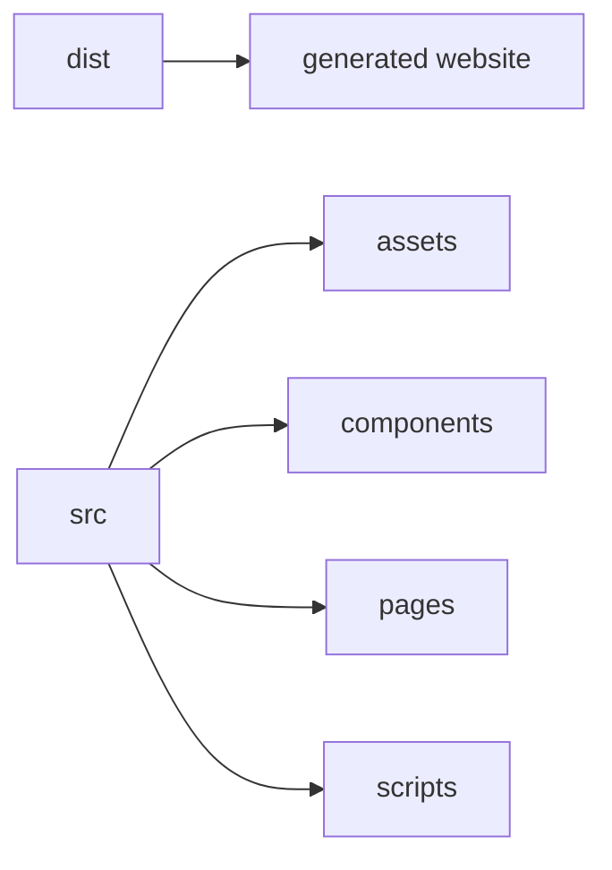
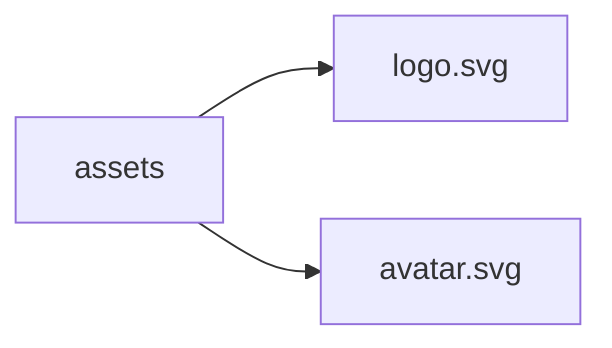
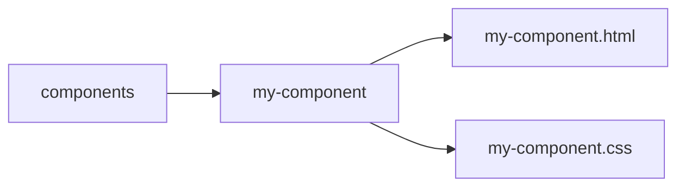
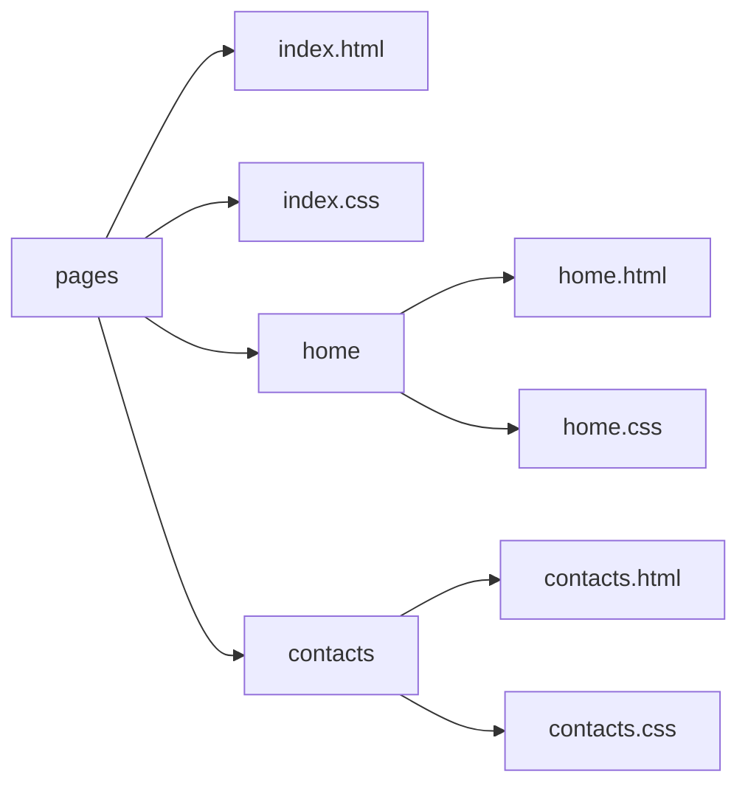
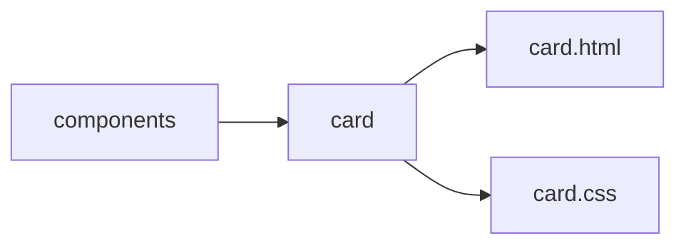

Matrio is a static site generator tool in Python. It uses custom tags to facilitate the creation of HTML pages by giving users the option of dividing their static websites into components.

All this, while hosting the generated site (one or more pages) and with a hot reload function (in beta).

## Prerequisites

- Python 3.9 or higher ( **python --version** to check )
- Pip ( **pip --version** to check )

**Installation prerequisites**

Python 3.9 : https://www.python.org/downloads/

Pip should normally be installed automatically with python, but if after checking you can't use it in your console :
https://pip.pypa.io/en/stable/installation/

## Installation

Install the necessary dependencies with pip.

- pip install -r requirements.txt

or 

- python -m pip install -r requirements.txt

or if you have this error **This environment is externally managed** do this before :

- python -m venv venv
- source venv/bin/activate

## Generic use

**Command to launch matrio :**
- python matrio.py 

but first, there's the project tree :

### Tree structure :

Everything in the **src** folder is the basis for what will be generated in the **dist** folder.

So at the end, in the **dist** folder, there will be **one or several html files** (the same number as your number of html files in the page folder), an **assets folder**, an **scripts folder** and a **style.css** file containing all the css for the pages and components.

**Assets :**  
Is the folder where you will place your website assets such as images or fonts.

Exemple:

**Components:**
Is the folder where you will place your website components. Remember, each component in Matrio is a folder made up of an html and css file of the same name.

**Pages:**
Is the folder where you will place an html file for each page of your website.
Don't forget to include the **style.css** file in each page and to name one of the pages **index.html**.
This will be the page accessible directly on http://localhost:4200/

**Scripts:**
In this case, it only contains the websocket script that allows the website to be hot reloaded in the event of a modification to one of the files in src.

_This is a very unstable feature at the moment, as the injection of several scripts has not been tested, and manual hot reloading is sometimes necessary._

### Injecting a component into a page :

In your page or component, create a matrio tag like this :

    <matrio  path="components/card/card"></matrio>

The matrio tag will be interpreted and replaced by the content of the html file at the following path : **"components/card/card"**

Here's **what the components folder should contain as a minimum** for the injection to work

## **A few more features**

**Matrio tag to be replace :**

    <matrio  path="components/card/card"  class="brown">
        Content
    </matrio>

**Component to inject :**

    

    	<matrio  path="components/title/title"></matrio>
    	<matrio-content></matrio-content>
    

As you can see, there is now a **class attribute** with the value "brown" on the matrio tag.

**This class will be added to the class values of the div with the matrio-class attribute in the targeted component**
In this case, the div with the "card" class.

You've probably noticed that the matrio tag **now contains the word "Content".**

**Everything contained in the matrio tag will replace the component's matrio-content tag.**

**Last but not least, a component can itself contain a matrio tag to inject a component into its html.**

## **Warning**

Matrio is still in development, so its stability is not guaranteed.
